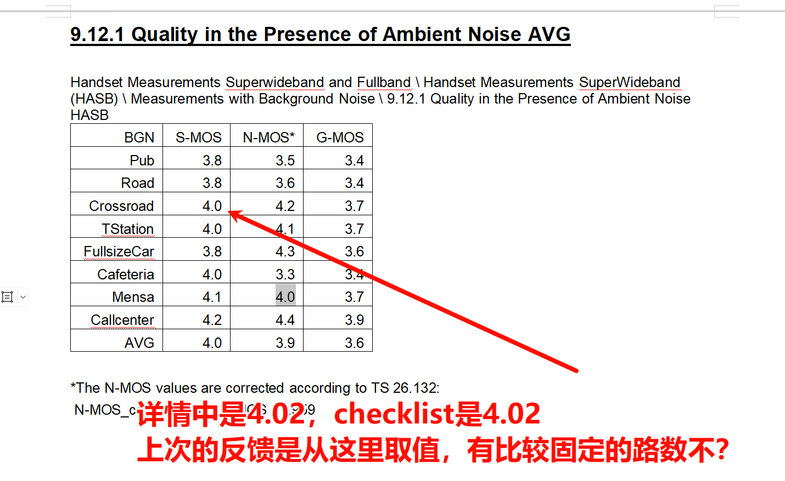

# 报告检查功能，需求如下：

## 功能描述
- 用户上传一个word测试报告，测试报告内容及其格式可以参考`docs` 目录下的`Utah_Handset_mode_VOLTE_EVS_SWB_0521.doc`;
- 用户再上传一个I列数据区域为空值的excel文件，也就是checklist，可以参考`docs` 目录下的`moto_checlist_空.xlsx`;
- 数据提取规则为`TN_Audio\TN_Audio_Tools\src\renderer\modules\reportChecker\config\moto_rules_for_analysis.json5`,这个提取规则是其他AI生成的，如果有问题，你可以看着修改调整；
- 输出文件为`docs`目录下的`Utah_Voice_Tuning_Checklist_v5.0.2_Handset_mode_VOLTE_EVS_SWB_0522_人工版本.xlsx`,请以这个为标靶；

## 注意事项
- 例如在checklist中`Handset`这个sheet页面的`I52`这个单元格，需要填写的数据是在word测试报告测试详情中title为`Quality in the Presence of Ambient Noise AVG`中提取，从标靶来看需要的数据是`S-MOS`在`Corssroads`在的表现，那么针对我给你截图的表格，当前的提取规则可能无法正确提取数据，需要你做出调整；另外就是这种表格，可能存在说标靶文件里面`I52`这里的值写的是`4.02`，因为这个`4.02`是测试详情中的值，在这个表格中是做了四舍五入处理的，还是以表格中的为准也可以；

## 需求增加
- 原本我的`TN_Audio\TN_Audio_Tools\src\renderer\modules\reportChecker\config\moto_rules_for_analysis.json5`,这个规则文件，是让AI基于`docs`目录下的`moto测试报告数据提取手写规则-0312更新.xlsx`61行及以上的内容生成的，现在我补充了61行下面的手写规则，请根据我手写的规则，参考原本的`moto_rules_for_analysis.json5`,补充剩下的规则，并验证测试是是否能够提取数据做到和标靶文件一样