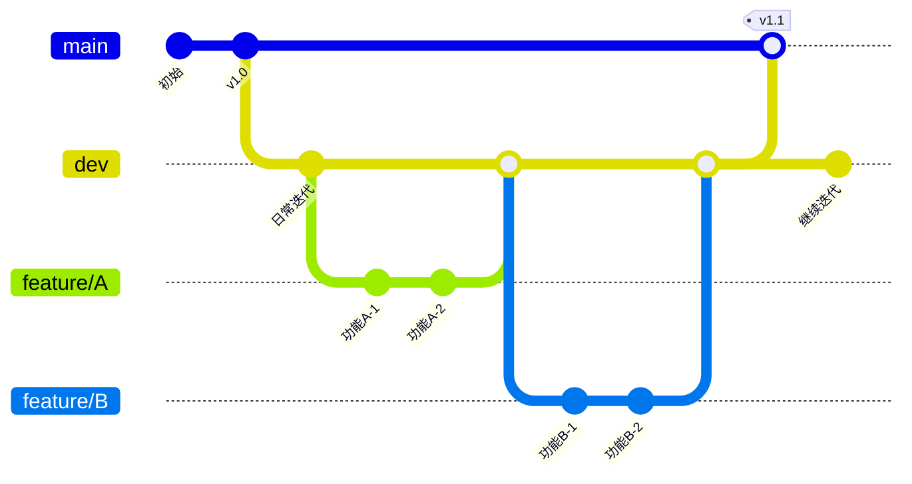
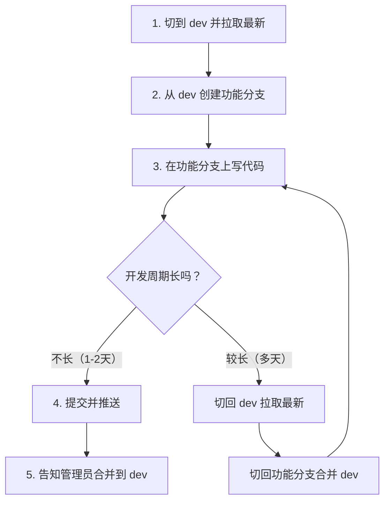
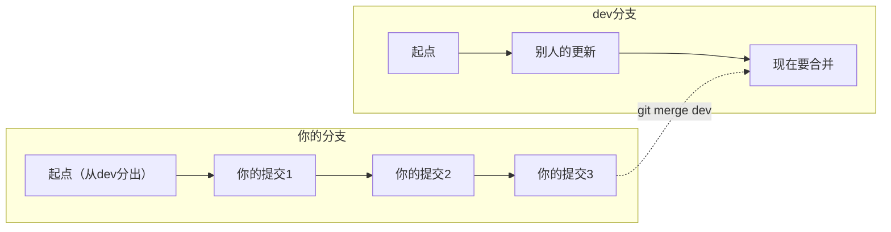

# 新手指南

本指南写给参与 TN Audio Toolkit 项目维护、但不熟悉软件开发流程的同事。每一步都尽量详细，跟着做就行。遇到问题先翻到最后的「常见问题」部分。

---

## 0. 开始之前（重要！必读）

### 你需要在本机安装这些软件

| 软件 | 下载地址 | 备注 |
|------|----------|------|
| **Node.js 18+** | https://nodejs.org | 选 LTS 版本，一路下一步即可 |
| **Git** | https://git-scm.com/download/win | 安装时全部默认选项即可 |
| **Cursor** 或 **VS Code** | https://cursor.com 或 https://code.visualstudio.com | 推荐 Cursor，AI 辅助写代码 |

安装完成后，打开一个终端（PowerShell 或 CMD），验证一下：

```powershell
node --version    # 应显示 v18.x.x 或更高
npm --version     # 应显示 9.x.x 或更高
git --version     # 应显示 git version 2.x.x
```

### 你不需要配 SSH（直接用 HTTPS）

**公司网络下，Gitee 只能走 HTTPS（SSH 的 22 端口被公司网络屏蔽了）。** 所以直接走 HTTPS，不需要生成 SSH Key。

首次推送时会提示输入 Gitee 账号和密码（或私人令牌），后面会教你怎么做。

> 如果你需要访问 GitHub（SSH 22 端口在公司网络下对 GitHub 是通的），见附录。

---

## 1. 克隆项目到本地

### 1.1 打开终端

在你要放代码的文件夹（比如桌面）右键 → "在终端中打开"（Windows 11），或者打开 CMD/PowerShell 后 `cd` 到目标目录。

### 1.2 克隆

```powershell
git clone https://gitee.com/lingyu_mayun/TN_Audio_Check_Tools.git
```

克隆完成后会多出一个 `TN_Audio_Check_Tools` 文件夹，里面就是项目代码。

> 如果提示找不到仓库，可能是仓库已设为私密。确认你已注册 Gitee 账号并告知管理员添加权限。

### 1.3 进入项目目录

```powershell
cd TN_Audio_Check_Tools\TN_Audio_Tools
```

### 1.4 切换到开发分支

刚克隆下来时默认在 `master` 分支。**日常开发不在 master 上做**，要先切到 `dev`：

```powershell
git switch dev
```

> **记住**：`master` = 稳定发布版，`dev` = 日常开发版。所有工作基于 `dev`。

### 1.5 安装依赖

```powershell
npm install
```

这一步会下载所有依赖包，大约需要 2-5 分钟，取决于网络。

### 1.6 启动开发环境

```powershell
npm start
```

这会同时启动 React 前端和 Electron 桌面窗口。看到应用窗口弹出来，说明环境 OK。

---

## 2. 理解分支结构（先看这张图）

在开始写代码之前，先理解项目的分支是怎么组织的。



> 图中 `main` = `master`（GitHub 默认叫 main，本项目叫 master，是一回事）

**这张图说明了什么？**

| 分支 | 用途 | 你在上面写代码吗？ |
|------|------|:------------------:|
| `master` | 稳定发布版，只有正式发版时才更新 | 不 |
| `dev` | 日常开发基线，所有新功能最终汇聚到这里 | 不 |
| `feature/xxx` | 你正在做的某个具体功能 | **是，只在这里写** |

**核心规则就一条**：永远不在 `master` 和 `dev` 上直接改代码。所有改动都在 `feature/` 或 `fix/` 分支上进行。

---

## 3. 日常开发完整流程

下面用一个具体例子，从零开始走完一次功能开发的全部步骤。

### 流程图总览



### 3.1 第一步：切到 dev 并拉取最新

开始任何新工作前，先确保你的本地 `dev` 是最新的：

```powershell
git switch dev
git pull origin dev
```

这步的作用：把别人最近推送的更新同步到你本机，避免后面合并时冲突。

### 3.2 第二步：从 dev 创建功能分支

```powershell
git switch -c feature/你的功能名
```

这条命令做了两件事：
1. 以当前 `dev` 为蓝本创建一个新分支
2. 自动切换到这个新分支上

**分支命名规则**：

| 类型 | 前缀 | 示例 |
|------|------|------|
| 新功能 | `feature/` | `feature/report-review-optimization` |
| Bug 修复 | `fix/` | `fix/settings-crash` |
| 代码整理 | `refactor/` | `refactor/update-module` |

用英文小写，单词之间用 `-` 连接，不要用空格或中文。

### 3.3 第三步：在功能分支上开发和提交

这一步是你写代码的主战场。写完一个阶段性成果后，提交一次：

```powershell
# 1. 看看改了哪些文件
git status

# 2. 把改动加入暂存区
git add .

# 3. 提交到本地仓库
git commit -m "feat: 新增批量导出功能"
```

**提交信息规范**（冒号后面有一个空格）：

| 前缀 | 什么时候用 | 示例 |
|------|-----------|------|
| `feat:` | 加了新功能 | `feat: 新增频谱分析导出` |
| `fix:` | 修复了 Bug | `fix: 修复设置页闪退问题` |
| `refactor:` | 整理代码，不改功能 | `refactor: 提取公共校验逻辑` |
| `docs:` | 只改了文档 | `docs: 更新新手指南` |

> 每完成一个小目标就提交一次，不要攒一大堆一起提交。好比写 Word 文档时点 Ctrl+S——多保存没坏处。

### 3.4 第四步：推送到远程仓库

```powershell
git push origin feature/你的功能名
```

这一步把你的分支上传到 Gitee，别人就能看到了。

**首次推送时**会弹出一个窗口让你输入 Gitee 账号密码。如果你不想每次输密码，可以创建私人令牌代替密码：

1. 浏览器登录 https://gitee.com → 右上角头像 → 设置
2. 左侧菜单「私人令牌」→ 生成新令牌
3. 权限勾选 `projects`，提交
4. 复制生成的令牌字符串
5. 以后 `git push` 提示密码时，粘贴这个令牌即可

### 3.5 中间同步：当 dev 又往前走了

假设你的功能做了五天，期间别人也在更新 `dev`。你需要把别人的更新吸收进来，不然你的分支就和 `dev` 越来越远了。



具体操作：

```powershell
# 1. 切到 dev，拉取最新
git switch dev
git pull origin dev

# 2. 切回你的功能分支
git switch feature/你的功能名

# 3. 把 dev 的新内容合并进来
git merge dev
```

如果合并过程中提示冲突（conflict），不要慌——说明你和别人改了同一个文件的同一个位置。这时把冲突文件的内容整理好，保存，然后：

```powershell
git add .
git commit -m "merge: 同步 dev 最新内容"
```

搞不定就找管理员帮忙。

### 3.6 小结：你只需要记住这五条命令

```powershell
git switch dev                       # 1. 切到 dev
git pull origin dev                  # 2. 拉取最新
git switch -c feature/xxx            # 3. 创建功能分支
# ... 写代码，多次 git add + git commit ...
git push origin feature/xxx          # 4. 推送到远程
# 5. 告知管理员：我的分支可以合并了
```

---

## 4. 用 Cursor 打开项目（推荐）

1. 打开 Cursor
2. 点击 `File` → `Open Folder`
3. 选择 `TN_Audio_Check_Tools\TN_Audio_Tools` 文件夹
4. Cursor 会自动识别这是一个 Node.js + React 项目
5. 在 Cursor 内置终端（`` Ctrl+` ``）中执行上面的 git 命令

Cursor 的 AI 功能可以帮你写代码、查 Bug、解释代码。

---

## 5. 提交代码前自检清单

每次 `git commit` 之前确认：

- [ ] 你的代码能跑起来（`npm start` 不报错）
- [ ] 你在正确的分支上（`git branch` 确认，不是 `dev` 或 `master`）
- [ ] 没有把 `node_modules/`、`dist/`、`.env` 等不该提交的文件加进去
- [ ] commit message 写清楚了改动内容
- [ ] 只改了你应该改的文件，没有误改其他文件

---

## 6. 关于网络（公司网络下的已知限制）

经过实测，公司网络对外部 Git 服务的访问有限制：

| 目标 | HTTPS (443) | SSH (22) |
|------|:----------:|:--------:|
| **Gitee** | 通 | 不通 |
| **GitHub** | 不通 | 通 |

因此：

- **日常开发只需跟 Gitee 打交道**，默认 HTTPS 就能正常工作，不需要任何额外配置。
- GitHub 仅在需要时通过 SSH 访问（见附录）。

---

## 7. 常见问题

### Q: `npm install` 报错或很慢？
A: 先试试换成国内镜像：
```powershell
npm config set registry https://registry.npmmirror.com
npm install
```

### Q: 推送时提示 "Permission denied"？
A: 说明你没有仓库的推送权限。确认：
1. 已注册 Gitee 账号并登录 https://gitee.com
2. 已告知管理员将你添加为仓库成员

### Q: `git push` 提示输入用户名密码，输什么？
A: 用户名是 Gitee 注册时用的邮箱或手机号。密码推荐用 **私人令牌**：
1. 登录 Gitee → 右上角头像 → 设置 → 私人令牌
2. 生成新令牌，权限勾选 `projects`
3. 复制令牌，粘贴到密码输入处

### Q: 推送时提示 "Failed to connect to gitee.com port 22"？
A: 说明你不小心配了 SSH 方式。公司网络下 Gitee SSH（22 端口）不通，请改用 HTTPS：
```powershell
git remote set-url origin https://gitee.com/lingyu_mayun/TN_Audio_Check_Tools.git
```

### Q: 我改错了文件想撤销？
A:
```powershell
# 撤销单个文件的修改（回到上次提交的状态）
git checkout -- 文件名

# 撤销所有未提交的修改
git checkout -- .
```

### Q: 我在错误的分支上提交了怎么办？
A: 先别慌，告知管理员帮你处理。通常用 `git cherry-pick` 或 `git reset` 可以解决。

### Q: `npm start` 启动后窗口闪退？
A:
```powershell
# 先单独启动 React 看看报什么错
npm run react-start
```

### Q: 我不知道自己当前在哪个分支？
A:
```powershell
git branch
```
带 `*` 号的就是当前分支。

---

## 附录：SSH 方式（可选，仅在需要访问 GitHub 时配置）

日常开发只需要 Gitee + HTTPS，**不需要配置 SSH**。

SSH 仅在你需要访问 GitHub 时才有用（公司网络下 GitHub HTTPS 不通，但 SSH 通）。如果你不需要访问 GitHub，直接跳过本节。

1. 生成 SSH Key（如果还没有）：
```powershell
ssh-keygen -t ed25519 -C "你的邮箱@example.com"
```
一路回车即可。生成的文件在 `C:\Users\你的用户名\.ssh\id_ed25519.pub`。

2. 用记事本打开 `id_ed25519.pub`，复制全部内容，发给管理员。

3. 管理员在 GitHub 上添加你的公钥后，在本机添加 GitHub remote：
```powershell
git remote add github git@github.com:JohnsonJinyu/TN_Audio_Check_Tools.git
```

> 注意：SSH Key 是配置在 GitHub 上的，和 Gitee 无关。Gitee 统一走 HTTPS。

---

## 一句话总结

```powershell
# 每次开发就这五步：
git switch dev
git pull origin dev
git switch -c feature/你的功能名
# ... 写代码 ...
git add .
git commit -m "feat: 做了什么"
git push origin feature/你的功能名
```

搞不定就问管理员，不要强行操作。
